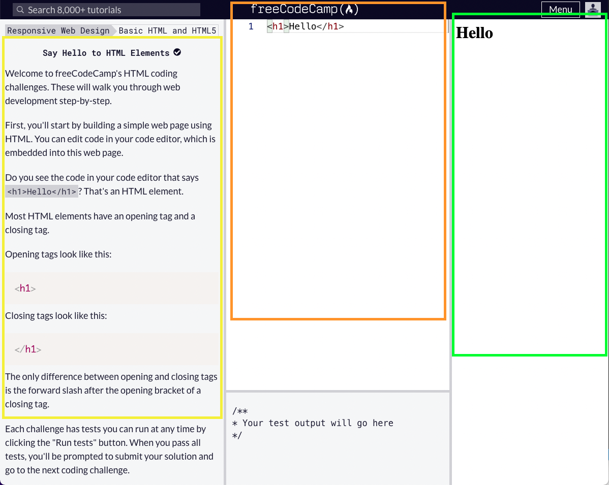

# Worked Examples

Familiarise yourself with the interface:

#### Assignment 1

[Say Hello to the Html Elements](https://www.freecodecamp.org/learn/responsive-web-design/basic-html-and-html5/say-hello-to-html-elements)



#### Assignment 2

[Headline with h2 element](https://www.freecodecamp.org/learn/responsive-web-design/basic-html-and-html5/headline-with-the-h2-element)
